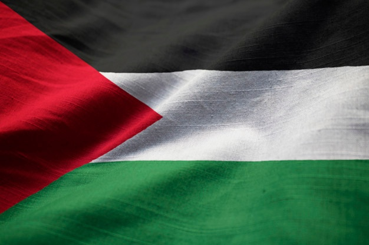

    

[Leve Palestina](https://levepalestina.netlify.app/)

  <!-- <a href="https://cs50x.netlify.app">Demo</a> -->

---
<!-- Status -->

<!-- <h4 align="center"> 
	🚧  CS50X 🚀 Under construction...  🚧
</h4> 

 -->

  <a href="#dart-about">About</a> &#xa0; | &#xa0;
  <a href="https://github.com/AH-SALAH" target="_blank">Author</a>

## :dart: About ##
This in order to let people hear and know what's happened to Palestine Land and Palestine People, increase the world nations concious about Palestinians and their rights & legal missions.

Made with :duck: by <a href="https://github.com/AH-SALAH" target="_blank">AH-SALAH</a>
