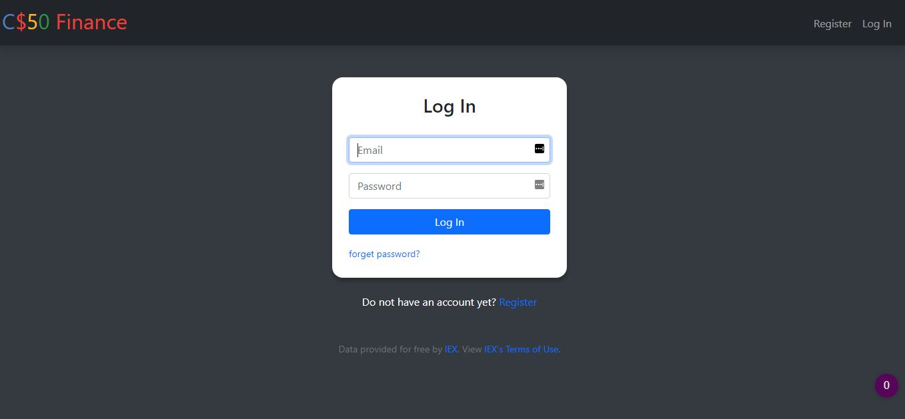
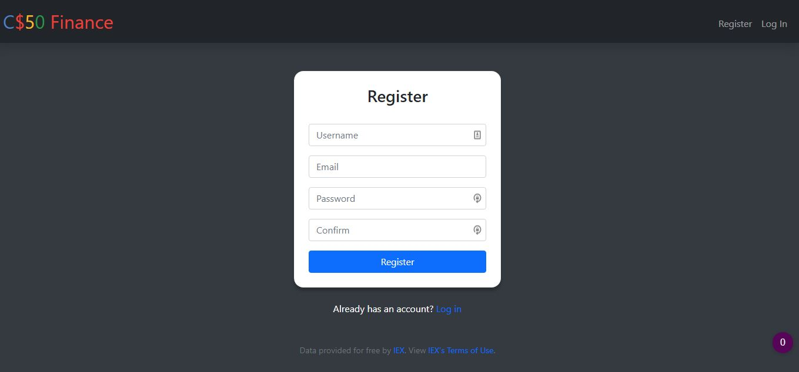
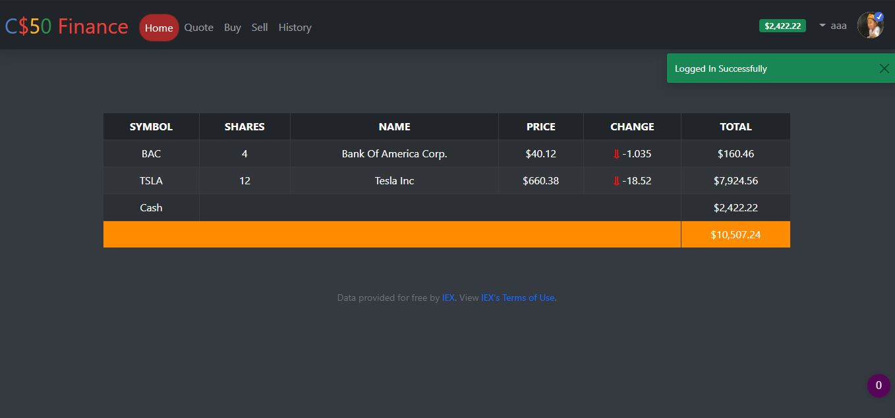
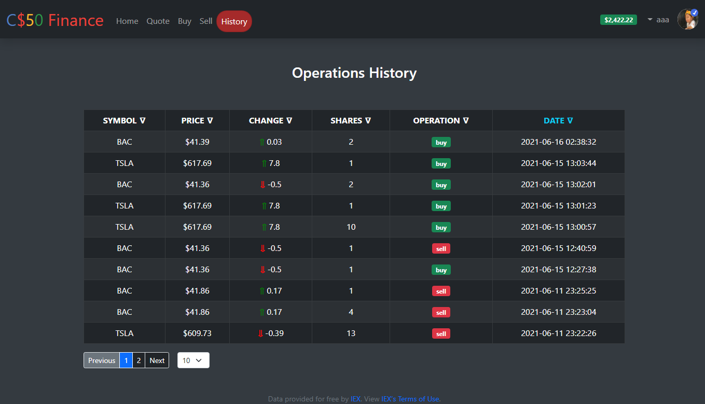

### CS50 Finance
- [project instructions Url](https://cs50.harvard.edu/x/2021/psets/9/finance/)

<hr>

***
Screenshots







***
#### Setup

- create config.cfg file with the following

---
```
SECRET_KEY=<Secret_KEY>
SENDGRID_API_KEY='<API>'
MAIL_USERNAME="<Mail_Username>"
MAIL_SECRET="<Secret>"
MAIL_SALT="<Salt>"
MAX_CONTENT_LENGTH= 2097152 # 2mb
UPLOAD_EXTENSIONS=['.jpg', '.png', '.gif']
UPLOAD_PATH='uploads'
```

- Run the following in terminal

```
// SET the API_KEY [link](https://iexcloud.io/console/tokens) as envVar
$env:API_KEY="<API_KEY>" // https://iexcloud.io/console/tokens


./venv/Scripts/activate
$env:FLASK_APP="application"
$env:FLASK_ENV="development" // or "production"
$env:APP_SETTINGS="config.cfg"

flask run
```

---- You can adjust them for sure
